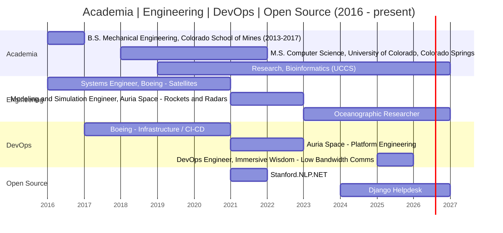

---

## Career Timeline

## Things I have supported/developed with (Gotta catch 'em all)
> **Academia**
> - B.S. Mechanical Engineering, Colorado School of Mines - 
> - M.S. Computer Science, University of Colorado Colorado Springs -  
> - [Research, Bioinformatics (UCCS)](https://github.com/OluwadareLab/ParticleChromo3D_Plus) - [Paper 1](https://link.springer.com/article/10.1186/s13040-022-00305-x), [Paper 2](https://pmc.ncbi.nlm.nih.gov/articles/PMC10046902/) -      
>
> **Engineering**
> - Systems Engineer, [Boeing](https://www.boeing.com/) - Satellites -        
> - Modeling and Simulation Engineer, [Auria Space](https://www.auria.space/) -                      
> - [Oceanographic Researcher](https://www.rcuh.com/) -                  
>
> **DevOps**
> - Boeing - Infrastructure / CI-CD -                      
> - Auria Space - Platform Engineering -   
> - DevOps Engineer, [Immersive Wisdom](https://www.immersivewisdom.com/) -            
>
> **Open Source**
> - [Stanford.NLP.NET](https://github.com/sergey-tihon/Stanford.NLP.NET) - 
> - [Django Helpdesk](https://github.com/django-helpdesk/django-helpdesk) -  
